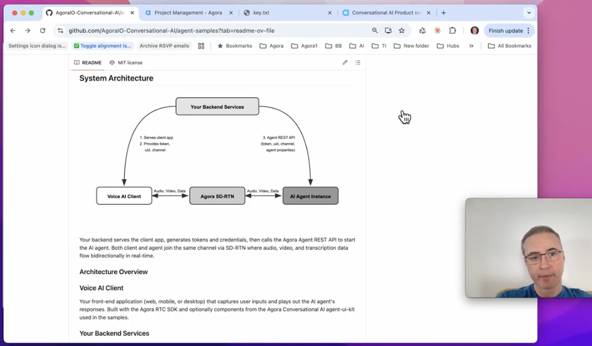

# Build Agora Voice & Video AI Agents with Vibe Coding — No Coding Experience Required

_How I used Claude Code to clone, configure, and run Agora's Conversational AI samples on my Mac — and you can too._

---

If you've been curious about building real-time voice and video AI agents but felt intimidated by the setup, this post is for you. In the accompanying video demo, I walk through the entire process of using Claude Code to build and run the Agora Conversational AI agent samples — from cloning the repo to having a live conversation with an AI agent, all running locally on my Mac.

This blog post serves as a companion guide. It covers the prerequisites, explains how the system architecture works, and walks through the API keys you'll need before you can follow along with the video.

## What Are We Building?

The [Agora Conversational AI Agent Samples](https://github.com/AgoraIO-Conversational-AI/agent-samples) repo contains everything you need to run voice and video AI agents locally. The samples use Agora's real-time network (SD-RTN) to handle the audio and video streaming, while connecting to your choice of LLM and text-to-speech providers for the actual AI conversation.

By the end of the video demo, you'll have a working voice AI agent you can talk to in your browser and, if you choose, a video avatar agent that gives your AI a face.

The best part? Claude Code does the heavy lifting. You give it a prompt, point it at the repo, and it handles the cloning, dependency installation, configuration, and running of both the backend and frontend.

---

## Watch the Video

The companion video walks through every step live, including the moments where Claude Code asks clarifying questions, handles errors, and gets both servers running. If you're a visual learner or want to see exactly what to expect, start here.

[](https://drive.google.com/file/d/1COGNNbLUkBFAT2XqLMqHFtOAg5tKisSZ/view?usp=sharing)

---

## Prerequisites

Before following the video, you'll need two things set up: Claude Code and a basic comfort level with the terminal.

### Installing Claude Code

Claude Code is Anthropic's command-line AI coding assistant. It runs in your terminal and can read, write, and execute code on your behalf. You'll need an Anthropic account with either a Claude Pro/Max subscription or API credits.

**On Mac**, open Terminal and run:

```bash
curl -fsSL https://claude.ai/install.sh | bash
```

That's it — no Node.js required. The native installer handles everything. After it finishes, verify the installation:

```bash
claude --version
```

**On Windows**, you have two options. The simplest is to open PowerShell and run:

```powershell
irm https://claude.ai/install.ps1 | iex
```

Alternatively, if you prefer working inside WSL (Windows Subsystem for Linux), install WSL first, then use the same curl command as Mac inside your Ubuntu terminal.

After installation, launch Claude Code by typing `claude` in your terminal. The first time you run it, you'll complete a one-time authentication flow — either signing in with your Claude Pro/Max account or providing an API key from the Anthropic Console.

### A Quick Terminal Primer

If you're new to the terminal, here are the only commands you need to know to follow along. Everything else, Claude Code handles for you.

**`pwd`** (Print Working Directory) — Shows you where you currently are in the file system. Think of it as "Where am I right now?"

```bash
$ pwd
/Users/yourname
```

**`ls`** (List) — Shows the files and folders in your current directory. It's like opening a folder in Finder to see what's inside.

```bash
$ ls
Desktop    Documents    Downloads    Projects
```

**`cd`** (Change Directory) — Moves you into a different folder. This is how you navigate around.

```bash
$ cd Projects
$ pwd
/Users/yourname/Projects
```

**`mkdir`** (Make Directory) — Creates a new folder.

```bash
$ mkdir my-ai-project
$ cd my-ai-project
```

That's the extent of the terminal knowledge you need. Once you're in the right folder and launch Claude Code, you're communicating in plain English from that point forward.

---

## System Architecture: The Four Components

The Agora Conversational AI system has four main components. Two run on your local machine and two are cloud services managed by Agora.


**Your Backend Server** (local) — A Python server (`simple-backend`) that serves the client app, generates Agora authentication tokens, and calls the Agora REST API to start/stop AI agent instances. When you click "Join," it spins up an agent and connects it to a channel with your LLM and TTS configuration.

**The Client Application** (local) — A React web app running in your browser that captures your microphone audio and plays back the AI agent's responses. The repo includes a polished **React Voice Client** (recommended starting point), a **React Video Client with Avatar** for face-to-face-style AI conversations, and simpler HTML/JavaScript versions for quick testing.

**Agora SD-RTN** (cloud) — Agora's Software-Defined Real-Time Network, the global low-latency infrastructure that routes audio, video, and data between participants. Both client and agent join the same channel — audio flows bidirectionally through SD-RTN without you having to manage any WebRTC complexity.

**The AI Agent Instance** (cloud) — A managed agent that Agora spins up on your backend's request. It joins the channel like a real participant and runs the conversation pipeline: your speech is transcribed (STT), sent to your chosen LLM, and the response is converted to natural-sounding speech (TTS) and streamed back in real-time. It even handles interruption detection — if you start talking, the agent stops and listens.

---

## Getting Your API Keys

Before Claude Code can configure and run the samples, you'll need API keys from a few services. Here's where to get each one.

### Agora Credentials

You need three things from Agora:

**App ID and App Certificate** — Sign up for a free account at the [Agora Console](https://console.agora.io/), create a new project, and you'll find these under [Project Management](https://console.agora.io/project-management). The App Certificate is optional for testing but recommended.

**Agent Auth Header** — This is the Base64-encoded credential that authorizes your backend to call Agora's Conversational AI REST API. Generate it from the [RESTful API](https://console.agora.io/restful-api) section of the console. For more details, see Agora's [RESTful Authentication](https://docs.agora.io/en/conversational-ai/rest-api/restful-authentication) docs.

### LLM Provider

You'll need an API key from your chosen LLM provider. The samples default to OpenAI, so the fastest path is to grab an API key from [OpenAI's Platform](https://platform.openai.com/settings/organization/api-keys). Any OpenAI-compatible endpoint will work if you prefer a different provider.

### Text-to-Speech (TTS) Provider

The backend supports several TTS vendors. Pick one and get your API key:

- [**Rime**](https://rime.ai/) — Fast, high-quality voices
- [**ElevenLabs**](https://elevenlabs.io/) — Realistic, customizable voices with a wide voice library
- [**OpenAI**](https://platform.openai.com/) — Uses the same API key as your LLM if you go with OpenAI for both
- [**Cartesia**](https://cartesia.ai/) — Low-latency voice synthesis

You'll also need a Voice ID from your chosen provider. Each vendor's documentation or voice library has a catalog you can browse to find the voice you like.

### Avatar Provider (Video Client Only)

If you want to run the video avatar client, you'll need credentials from an avatar provider as well. Agora's documentation on [AI Avatar Overview](https://docs.agora.io/en/conversational-ai/models/avatar/overview) covers the supported vendors and configuration details.

### Keep Your Keys Handy

Once you have your keys, keep them in a note or text file. When you follow along with the video and Claude Code asks for configuration, you'll paste them into the `.env` file that Claude Code creates. Here's a preview of what you'll need:

```bash
# Agora
APP_ID=your_agora_app_id
APP_CERTIFICATE=your_agora_app_certificate
AGENT_AUTH_HEADER=your_base64_encoded_credentials

# LLM
LLM_API_KEY=your_openai_api_key

# TTS
TTS_VENDOR=elevenlabs          # or: rime, openai, cartesia
TTS_KEY=your_tts_api_key
TTS_VOICE_ID=your_chosen_voice_id
```

---

## Let Claude Code Do the Work

With your prerequisites set up and API keys ready, you're all set to follow along with the video. Here's the prompt I use to kick things off:

**For Voice:**

```
Clone https://github.com/AgoraIO-Conversational-AI/agent-samples
and then I want to run the React Voice AI Agent here on my laptop.
Be sure to read the AGENT.md before you begin building.
```

**For Video with Avatar:**

```
Clone https://github.com/AgoraIO-Conversational-AI/agent-samples
and then I want to run the Video AI Agent with Avatar Sample here
on my laptop. Be sure to read the AGENT.md before you begin building.
```

Claude Code reads the repo's `AGENT.md` file (a comprehensive guide written specifically for AI coding assistants), clones the repository, installs all dependencies, prompts you for your API keys, configures the environment files, and starts both the backend and frontend servers.

Within minutes, you'll have a working AI voice agent running in your browser that you can talk to in real-time.

---

## Wrapping Up

What used to require deep knowledge of WebRTC, server configuration, and multiple API integrations can now be accomplished with a single prompt to Claude Code. The combination of Agora's well-documented agent samples and Claude Code's ability to read and follow that documentation makes this one of the most accessible ways to get started with real-time conversational AI.

If you build something interesting with these samples, I'd love to hear about it. Drop a comment or reach out — and happy building.

---

## References

- **Agora Conversational AI Agent Samples** (MIT) — [github.com/AgoraIO-Conversational-AI/agent-samples](https://github.com/AgoraIO-Conversational-AI/agent-samples)
- **Agora Conversational AI Documentation** — [docs.agora.io/en/conversational-ai/overview/product-overview](https://docs.agora.io/en/conversational-ai/overview/product-overview)
- **Claude Code Setup Guide** — [code.claude.com/docs/en/setup](https://code.claude.com/docs/en/setup)
- **Agora Console** — [console.agora.io](https://console.agora.io/)
- **OpenAI API Keys** — [platform.openai.com](https://platform.openai.com/settings/organization/api-keys)
- **TTS Providers** — [Rime](https://rime.ai/) | [ElevenLabs](https://elevenlabs.io/) | [OpenAI TTS](https://platform.openai.com/) | [Cartesia](https://cartesia.ai/)
