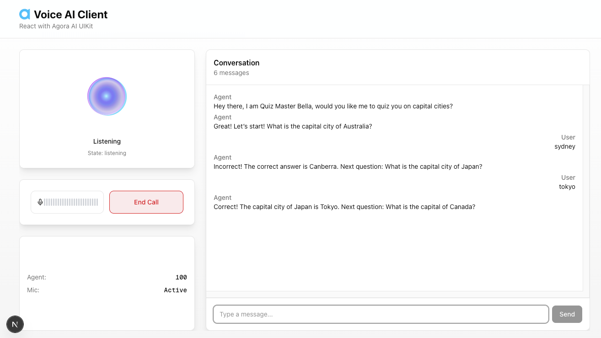
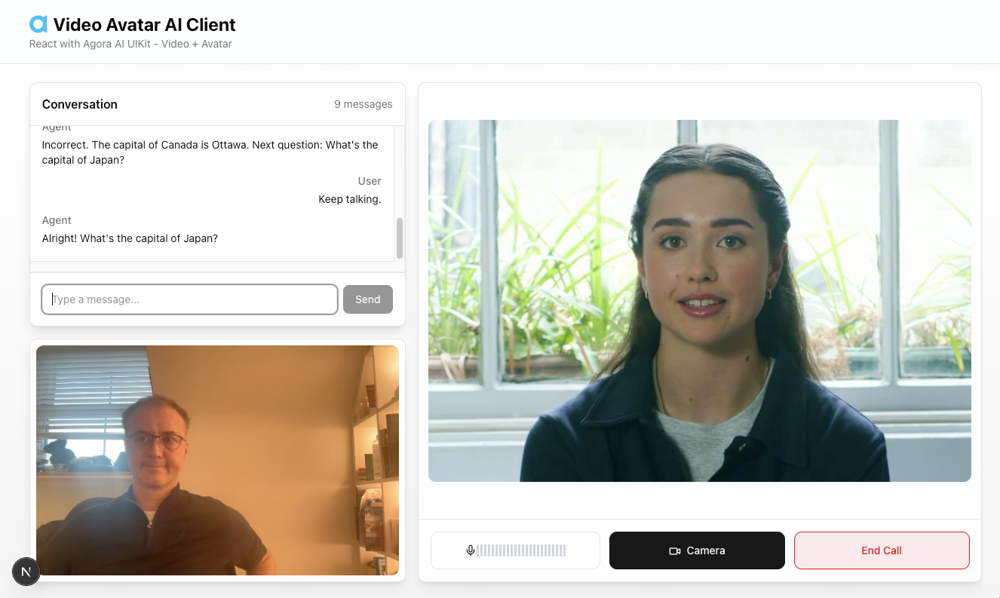

#  Agora Conversational AI

A guide to understanding and implementing Agora voice and video AI agents. Spin
up the sample backend and one of the sample clients or ask AI to do it for you.

- [AI Coding Assistant Guide](#ai-coding-assistant-guide)
- [System Architecture](#system-architecture)
- [Backend Sample](#backend-sample)
- [Client Samples](#client-samples)

## AI Coding Assistant Guide

**Comprehensive implementation guide for AI agents** → [AGENT.md](./AGENT.md)

## System Architecture


Your backend serves the client app, generates tokens and credentials, then calls
the Agora Agent REST API to start the AI agent. Both client and agent join the
same channel via SD-RTN where audio, video, and transcription data flow
bidirectionally in real-time.

### Architecture Overview

### Voice AI Client

Your front-end application (web, mobile, or desktop) that captures user inputs
and plays out the AI agent's responses. Built with the Agora RTC SDK and
optionally components from the Agora Conversational AI agent-ui-kit used in the
samples.

### Your Backend Services

Your server-side application that authenticates users, generates Agora tokens,
and orchestrates the AI agent. It serves the client app and calls the Agora REST
API to start/stop agent instances.

### Agora SD-RTN

Agora's Software-Defined Real-Time Network. A global low-latency network that
routes audio, video, and data streams between participants in real-time.

### AI Agent Instance

A managed AI agent that joins the channel as a participant. It listens to user
audio, processes it through STT → LLM → TTS, and streams the response back.

## Backend Sample

To run the server sample that your voice client will connect to, you will need:

**Agora Credentials:**

```bash
APP_ID=                  # Required: Agora Console
APP_CERTIFICATE=         # Optional for testing: Agora Console
AGENT_AUTH_HEADER=       # Required: Agora Console
```

- **APP_ID / APP_CERTIFICATE**
  - Console: [Project Management](https://console.agora.io/project-management)
  - Help: [Manage Agora Account](https://docs.agora.io/en/conversational-ai/get-started/manage-agora-account)
- **AGENT_AUTH_HEADER**
  - Console: [RESTful API](https://console.agora.io/restful-api)
  - Help: [RESTful Authentication](https://docs.agora.io/en/conversational-ai/rest-api/restful-authentication)

**LLM & TTS Providers:**

```bash
LLM_API_KEY=            # Required: OpenAI or compatible API key
TTS_VENDOR=             # Required: rime, elevenlabs, openai, or cartesia
TTS_KEY=                # Required: API key for your TTS vendor
TTS_VOICE_ID=           # Required: Voice/speaker ID for your chosen vendor
```

- **LLM**: [OpenAI API Keys](https://platform.openai.com/settings/organization/api-keys)
- **TTS**: [Rime](https://rime.ai/) | [ElevenLabs](https://elevenlabs.io/) | [OpenAI](https://platform.openai.com/) | [Cartesia](https://cartesia.ai/)

### Sample

**[Simple Backend](./simple-backend/)** Python backend for creating AI agents
and generating RTC credentials. Supports local development, cloud instances, and
AWS Lambda deployment.

## Client Samples

### Core Packages

- **[agent-toolkit](https://github.com/AgoraIO-Conversational-AI/agent-toolkit)** - Core SDK toolkit with RTC/RTM helpers and React hooks
- **[agent-ui-kit](https://github.com/AgoraIO-Conversational-AI/agent-ui-kit)** - React UI components for voice, chat, and video

### Samples

Recommended and complete React JS client samples which look great on any device.

**[React Voice Client](./react-voice-client/)** Responsive React/Next.js voice
client built with SDK packages and UI Kit. Features TypeScript, real-time
transcription display, voice controls, and integrated text chat.



**[React Video Client with Avatar](./react-video-client-avatar/)** React/Next.js
client with video avatar and local camera support. Includes responsive layouts
and multi-stream video rendering.



### Basic Samples

**[Simple Voice AI Client](./simple-voice-client/)** Standalone HTML/JavaScript
client for testing voice agents. Maintains persistent RTC connection allowing
agents to join and leave without client reconnection.

**[HTML/JS Voice AI Client](./complete-voice-client/)** Full-featured vanilla
JavaScript client demonstrating end-to-end integration with backend for agent
initialization and voice interaction.
